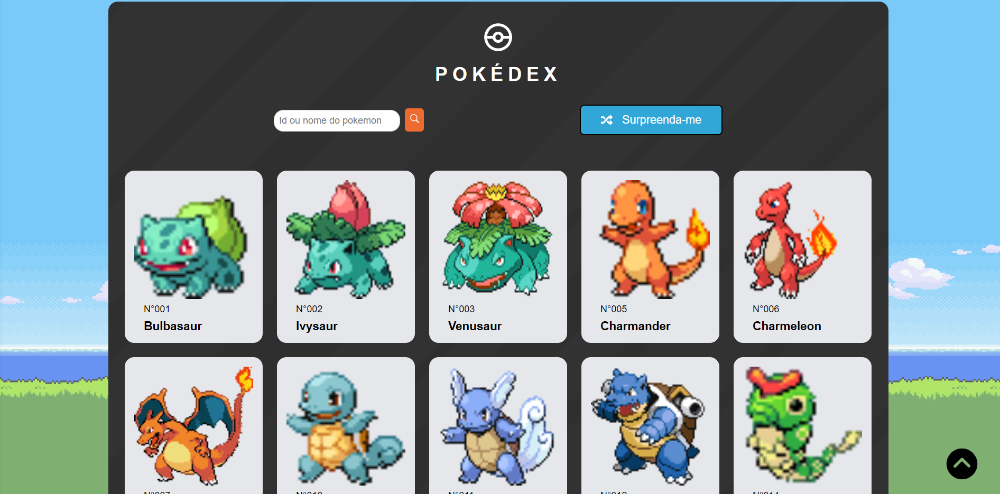

# PokéDex

A simple Pokémon catalogue, built with [React](https://reactjs.org/), [Redux-toolkit](https://redux-toolkit.js.org/), and [PokéAPI](https://pokeapi.co/).

## Links

Watch it in action [here](https://inocencio-pokedex.netlify.app/)

## Features

- View basic details of each Pokémon
- Search Pokémon by its Name/ID
- Scroll to top
- Get a ramdom pokemon
- Responsive design

## Snapshots

## Built With

- React
- Redux Toolkit
- React Query
- React Icons
- Vite
- PokéAPI

## Run locally

- Clone this repo
- Run `yarn` and `yarn dev`
- The application opens in `http://localhost:3000/` or any other available port

##

Contributions, issues and feature requests are always welcome!
Star the repo if you like this project :)
